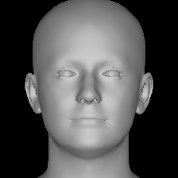
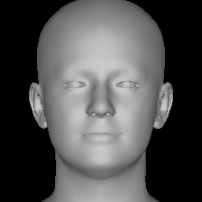
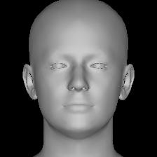
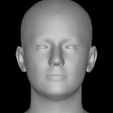
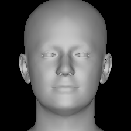

# NCKH - Nhận diện khuôn mặt 3D từ ảnh 2D

## Tóm tắt
Đây là repository của đề tài nghiên cứu: **"Nhận diện khuôn mặt 3D sử dụng mạng học sâu và tái tạo độ sâu từ ảnh 2D"**.
Hệ thống triển khai pipeline kết hợp thông tin ảnh 2D và biểu diễn 3D (DECA-based) để đánh giá mức đóng góp của nhánh 3D vào bài toán nhận diện khuôn mặt.

## Nhóm nghiên cứu
- **Đơn vị:** Trường Đại học Thăng Long
- **Thời gian thực hiện:** 10/2025 - 03/2026 (5 tháng)
- **Giảng viên hướng dẫn:** ThS. Ngô Mạnh Cường

**Thành viên:**
- A49651 Dương Thị Thùy Linh (Chủ nhiệm)
- A49971 Lê Nguyễn Nhật Huy
- A50059 Bùi Thế Duy

## Đóng góp chính
1. Xây dựng pipeline tái lập từ ảnh 2D đến xác minh danh tính gồm: tiền xử lý -> tái tạo/canonical 3D -> trích xuất embedding -> so khớp.
2. So sánh định lượng 3 chế độ `2D only`, `3D only`, `Fused` trên các bộ benchmark chuẩn.
3. Phân tích hiện tượng **identity collapse** của nhánh `3D only` và vai trò bù trừ của phương pháp kết hợp.

## Phương pháp
### 1) Tiền xử lý
- Phát hiện và căn chỉnh khuôn mặt bằng RetinaFace.
- Chuẩn hóa ảnh đầu vào trước khi đưa qua nhánh tái tạo/nhận diện.

### 2) Tái tạo 3D (DECA-based)
- Dùng backend DECA-based để ước lượng biểu diễn hình học khuôn mặt và sinh ảnh canonical chính diện.
- Repository dùng **checkpoint do nhóm huấn luyện theo hướng DECA-based**, không dùng mặc định checkpoint public DECA.

### 3) Nhận diện
- Trích xuất embedding bằng ArcFace cho cả nhánh 2D và nhánh canonical 3D.
- So khớp bằng cosine similarity.
- Chế độ `Fused` dùng trọng số thực nghiệm tốt: `w2d=0.8`, `w3d=0.2`.

## Dữ liệu và giao thức đánh giá
- **Huấn luyện chính:** VGGFace2.
- **Đánh giá:** LFW, AgeDB-30, CFP-FP.
- **Chỉ số:** ACC, AUC, EER.

## Kết quả chính
| Bộ dữ liệu | Chế độ | ACC | AUC | EER |
|---|---|---:|---:|---:|
| LFW | 2D only | 0.9982 | 0.9994 | 0.0030 |
| LFW | 3D only | 0.5473 | 0.5699 | 0.4560 |
| LFW | Fused | 0.9983 | 0.9993 | 0.0023 |
| AgeDB-30 | 2D only | 0.9782 | 0.9879 | 0.0287 |
| AgeDB-30 | 3D only | 0.5475 | 0.5612 | 0.4543 |
| AgeDB-30 | Fused | 0.9777 | 0.9882 | 0.0290 |
| CFP-FP | 2D only | 0.7041 | 0.7586 | 0.3051 |
| CFP-FP | 3D only | 0.6250 | 0.6574 | 0.3920 |
| CFP-FP | Fused | 0.6950 | 0.7432 | 0.3180 |

Ghi chú:
- LFW, AgeDB-30: chạy một lần theo cấu hình cố định.
- CFP-FP: trung bình 10-fold.

## Demo kết quả trực quan
### Demo ảnh đơn
| Aligned 112x112 | Canonical frontal |
|---|---|
|  |  |

### Demo cặp ảnh - cùng danh tính
| A canonical | B canonical |
|---|---|
|  |  |

### Demo cặp ảnh - khác danh tính
| A canonical | B canonical |
|---|---|
|  |  |

### Demo hàng loạt
- File báo cáo: [assets/demo_results/batch/batch_report.csv](assets/demo_results/batch/batch_report.csv)
- Trạng thái xử lý: 6/6 ảnh thành công (`ok`).

## Tái lập thực nghiệm
### 1) Cài đặt môi trường
```bash
python -m venv .venv
source .venv/bin/activate      # Windows PowerShell: .venv\\Scripts\\Activate.ps1
pip install -U pip setuptools wheel
pip install -r requirements.txt
```

### 2) Chuẩn bị backend DECA-based
Mã nguồn backend: https://github.com/yfeng95/DECA

```bash
git clone https://github.com/yfeng95/DECA.git
```

### 3) Chuẩn bị checkpoint của nhóm
- Link mô hình: https://drive.google.com/file/d/1dXVezV2eV4TqKXma9uoW24fnALE43nTP/view?usp=drive_link
- File đích: `models/team_face3d_model.tar`

```bash
pip install gdown
gdown --fuzzy "https://drive.google.com/file/d/1dXVezV2eV4TqKXma9uoW24fnALE43nTP/view?usp=drive_link" -O models/team_face3d_model.tar
```

### 4) Thiết lập biến môi trường
Linux/macOS:
```bash
export FACE3D_BACKBONE_PATH=<PATH_TO_DECA_MASTER>
export FACE3D_MODEL_TAR=<PROJECT_ROOT>/models/team_face3d_model.tar
```

Windows PowerShell:
```powershell
$env:FACE3D_BACKBONE_PATH="E:\path\to\DECA-master"
$env:FACE3D_MODEL_TAR="E:\path\to\NCKH_github\models\team_face3d_model.tar"
```

### 5) Chạy demo
Single (tái tạo):
```bash
python scripts/run_demo_single.py --image assets/sample_images/face_a.jpg --out-dir outputs/demo_single --align-template-3d 1.20
```

Pair (xác minh):
```bash
python scripts/run_demo_pair.py --image-a assets/sample_images/same_a.jpg --image-b assets/sample_images/same_b.jpg --out-dir outputs/demo_pair_same --align-template-3d 1.20
```

Batch (hàng loạt):
```bash
python scripts/run_demo_batch.py --image-dir assets/sample_images --out-dir outputs/demo_batch --max-images 100 --align-template-3d 1.20
```

## Cấu trúc thư mục
```text
NCKH_github/
  core/
  scripts/
  configs/
  models/
  assets/
  requirements.txt
```

## Trích dẫn
Nếu bạn sử dụng repository này, vui lòng trích dẫn:

```bibtex
@misc{nckh3dface2026,
  title        = {NCKH: Nhận diện khuôn mặt 3D từ ảnh 2D (DECA-based + ArcFace)},
  author       = {Duong Thi Thuy Linh and Le Nguyen Nhat Huy and Bui The Duy},
  year         = {2026},
  howpublished = {GitHub repository},
  url          = {https://github.com/duy1sme/NCKH-3D-Face-Recognition}
}
```

## Tài liệu tham khảo
- [1] Feng et al., *Learning an Animatable Detailed 3D Face Model from In-the-Wild Images (DECA)*, TOG 2021.
- [2] Deng et al., *ArcFace: Additive Angular Margin Loss for Deep Face Recognition*, CVPR 2019.
- [3] Cao et al., *VGGFace2: A Dataset for Recognising Faces across Pose and Age*, FG 2018.
- [4] Moschoglou et al., *AgeDB: The First Manually Collected, In-the-Wild Age Database*, CVPRW 2017.
